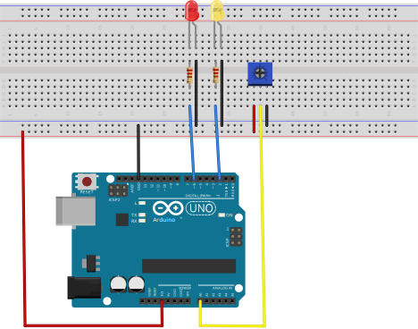
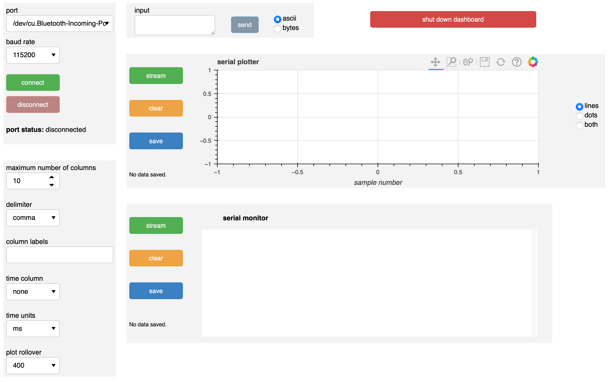
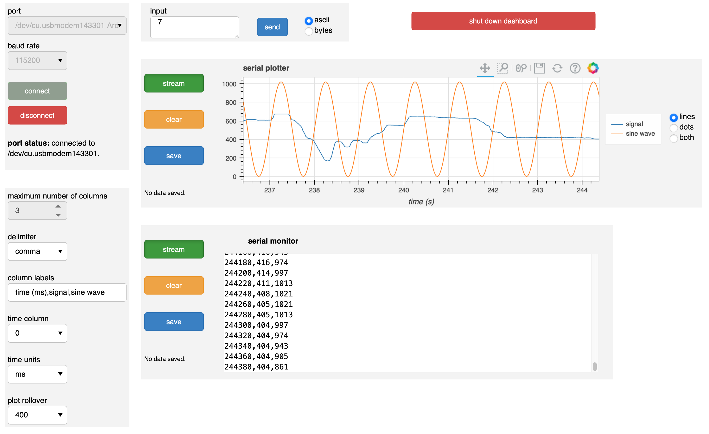

Using a dashboard
=================

The documentation below demonstrates and discusses use of the dashboard GUI. 

A sample device
---------------

In the examples, the dashboard uses a real device, which you may wish to construct to practice using the dashboard. I use an Arduino Uno, but you can use any board with a similar setup.

This simple test circuit has a potentiometer whose output is connected to an analog input. Two LEDs are under control of two digital pins. The following sketch is uploaded to the Arduino Uno board.

.. code-block:: arduino

	const int voltagePin = A0;

	const int redLEDPin = 6;
	const int yellowLEDPin = 2;

	const int HANDSHAKE = 0;
	const int REQUEST = 1;
	const int RED_LED_ON = 2;
	const int RED_LED_OFF = 3;
	const int GREEN_LED_ON = 4;
	const int GREEN_LED_OFF = 5;

	const int ON_REQUEST = 6;
	const int STREAM = 7;
	const int READ_DAQ_DELAY = 8;

	const int TOGGLE_SINE_WAVE = 9;

	const int HANDSHAKE_ASCII = 48;
	const int REQUEST_ASCII = 49;
	const int RED_LED_ON_ASCII = 50;
	const int RED_LED_OFF_ASCII = 51;
	const int GREEN_LED_ON_ASCII = 52;
	const int GREEN_LED_OFF_ASCII = 53;

	const int ON_REQUEST_ASCII = 54;
	const int STREAM_ASCII = 55;
	const int READ_DAQ_DELAY_ASCII = 56;

	const int TOGGLE_SINE_WAVE_ASCII = 57;

	String daqDelayStr;

	int inByte = 0;
	int daqMode = ON_REQUEST;
	int daqDelay = 100;

	unsigned long timeOfLastDAQ = 0;

	bool showSineWave = true;

	unsigned long printOutput() {
	  String outstr;
	  
	  // read value from analog pin
	  int value = analogRead(voltagePin);

	  // Time of acquisition
	  unsigned long timeMilliseconds = millis();

	  // Generate sine wave
	  int sineWave = (int) ((1.0 + sin(((float) timeMilliseconds) / 1000.0 * 2 * PI)) / 2.0 * 1023.0);

	  // Write the result
	  if (Serial.availableForWrite()) {
	    if (showSineWave) {
	      outstr = String(String(timeMilliseconds, DEC) + "," + String(value, DEC) + "," + String(sineWave, DEC));
	    }
	    else {
	      outstr = String(String(timeMilliseconds, DEC) + "," + String(value, DEC) + ",");        
	    }
	    Serial.println(outstr);
	  }

	  // Return the time of acquisition
	  return timeMilliseconds;
	}

	void setup() {
	  // Set LEDs to off
	  pinMode(redLEDPin, OUTPUT);
	  pinMode(yellowLEDPin, OUTPUT);
	  digitalWrite(redLEDPin, LOW);
	  digitalWrite(yellowLEDPin, LOW);

	  // initialize serial communication
	  Serial.begin(115200);
	}

	void loop() {
	  // If we're auto-transferring data (streaming mode)
	  if (daqMode == STREAM) {
	    if (millis() - timeOfLastDAQ >= daqDelay) {
	      timeOfLastDAQ = printOutput();
	    }
	  }

	  // Check if data has been sent to Arduino and respond accordingly
	  if (Serial.available() > 0) {
	    // Read in request
	    inByte = Serial.read();

	    // Handshake
	    if (inByte == HANDSHAKE | inByte == HANDSHAKE_ASCII){
	      if (Serial.availableForWrite()) {
	          Serial.println("Handshake message received.");
	      }
	    }

	    // If data is requested, fetch it and write it
	    else if (inByte == REQUEST | inByte == REQUEST_ASCII) printOutput();

	    // Switch daqMode
	    else if (inByte == ON_REQUEST | inByte == ON_REQUEST_ASCII) daqMode = ON_REQUEST;
	    else if (inByte == STREAM | inByte == STREAM_ASCII) daqMode = STREAM;

	    // Read in DAQ delay
	    else if (inByte == READ_DAQ_DELAY | inByte == READ_DAQ_DELAY_ASCII) {
	      while (Serial.available() == 0) ;
	      daqDelayStr = Serial.readStringUntil('x');
	      daqDelay = daqDelayStr.toInt();
	    }

	    // Toggle display of the sine wave
	    else if (inByte == TOGGLE_SINE_WAVE | inByte == TOGGLE_SINE_WAVE_ASCII) {
	      showSineWave = showSineWave ? false : true;
	    }

	    // else, turn LEDs on or off
	    else if (inByte == RED_LED_ON | inByte == RED_LED_ON_ASCII) digitalWrite(redLEDPin, HIGH);
	    else if (inByte == RED_LED_OFF | inByte == RED_LED_OFF_ASCII) digitalWrite(redLEDPin, LOW);
	    else if (inByte == GREEN_LED_ON | inByte == GREEN_LED_ON_ASCII) digitalWrite(yellowLEDPin, HIGH);
	    else if (inByte == GREEN_LED_OFF | inByte == GREEN_LED_OFF_ASCII) digitalWrite(yellowLEDPin, LOW);
	  }
	}

With this sketch, the board can take input as either bytes or as ASCII characters. In general, this is a good idea for ease of communication with a serial dashboard.

The board sends three different values for each data acquisition. It sends the time of the sampling, the voltage measured from the analog input pin, and a fabricated sine wave. It is generally a good idea to use time stamps from the board and not from the computer receiving the serial data, since the time on the board is closer to when the measurement was actually made. The fabricated sine wave is to demonstrate display on the dashboard.

The following input is accepted:

- **0**: Ask the board to send a confirmation that it received a message.
- **1**: Request a single set of time/voltage measurement/sine wave data.
- **2**: Turn on the red LED.
- **3**: Turn off the red LED.
- **4**: Turn on the yellow LED.
- **5**: Turn off the off LED.
- **6**: Specify that data is only to be sent from the board upon request.
- **7**: Specify that data is sent repeatedly from the board (streaming mode).
- **8**: Specify that the next text, ending in `x`, will be the delay in milliseconds between data acquisition in streaming mode.
- **9**: Toggles whether the sine wave should be sent or not.

Finally, note that the baud rate is set to 115200 baud. The baud rate chose on the dashboard should match what the board is going to use.

Dashboard layout
----------------

Upon launch, the dashboard will look like this:

With the exception of the big red ``shut down dashboard`` button, which has an obvious function, the dashboard is divided into boxes.

Port connectivity box
^^^^^^^^^^^^^^^^^^^^^

The upper left box is the port connectivity box. Its elements are:

- **port**: A pulldown menu that lists the available ports. You should select the port that is attached to the board you are interested in using for the dashboard.
- **baud rate**: A pulldown menu of baud rates. The allowed values are 300, 1200, 2400, 4800, 9600, 19200, 38400, 57600, 74880, 115200, 230400, 250000, 500000, 1000000, and 2000000.
- **connect**: When pushed, makes the connection to the serial device at the selected port.
- **disconnect**: When pushed, disconnects a connected board. Note that the ``disconnect`` button is grayed out upon launch, since it can only be pushed when a device is connected.
- **port status**: Text describing the status of the port.

When the ``connect`` button is pushed, the ``port``, ``baud rate``, and ``connect`` widgets are grayed out because they cannot be changed when connected to a device. The ``disconnect`` button becomes active, since you can now disconnect from a connected device. The ``send`` button in the input box (to the right of the port connectivity box) becomes active (it is inactive upon launch of the dashboard because no data can be sent when disconnected).

When the ``disconnect`` button is pushed, the ``port``, ``baud rate``, and ``connect`` widgets are reactivated, and the ``disconnect`` and ``send`` buttons are deactivated.

Importantly, when the ``connect`` button is pushed for the first time, the ``maximum number of columns`` selector in the plotter specification box (immediately below the port connectivity box) becomes inactive. It will *not* become active again for the rest of the lifetime of the dashboard. This is due to the underlying data structure of the plot generation process. So, you should think carefully about how many columns you might have in incoming data (three, in the sample case above) and make the appropriate selection *before* pushing the ``connect`` button.

----

Before proceeding to the remaining portions of the dashboard, let's look at the dashboard after we have set the parameters as we for the sample case, turned on data streaming, and had some live plotting and serial monitoring.

Plot specs box
^^^^^^^^^^^^^^

The plot specs box is under the port connectivity box and contains specifications for plot generation. Its elements are:

- **maximum number of columns**: A selector for the maximum number of columns, or different numbers in a single data acquisition from the board, that are expected. As described above, once a connection to a device is made, this choice is locked in, so think carefully before making a connection.
- **delimiter**: Delimiter of data coming off of the board. In looking at the serial monitor, we see that we have appropriately chosen a comma, since the three columns (time, signal, and a fabricated sine wave) are separated by commas.
- **columns labels**: Labels for columns. These labels are used to generate a legend in the plotter and also as column headings when saving the data on the plot as a CSV file.
- **time column**: column (zero-indexed) of incoming data that specifies time. If "none" is selected, the "time" axis on the plot is the sample number.
- **time units**: Units of incoming time data. This is only active if the ``time column`` selector is an integer and not "none."
- **plot rollover**: Number of data points to be shown on a plot for each column

With the exception of ``maximum number of columns``, all of these values may be changed in a live dashboard.

Input box
^^^^^^^^^

The input box is immediately to the right of the port connectivity box. The text box allows for input of any text. Only once the ``send`` button is pushed (*not* upon pressing enter on the keyboard) will the text be sent out to the connected device. The text will be sent either as ASCII text or as bytes, depending on the selection of the radio buttons at the right portion of the input box. Not that only integer values can be sent as bytes. This is part of the reason why it is useful to allow both bytes and ASCII text to be received and interpreted by connected devices, as we have done in the Arduino sketch above.

In this case, I have sent ``7`` to the board, meaning that I want it streaming data. Prior to sending ``7``, I sent ``820x``, which, if you review the Arduino sketch above, instructed the board to acquire and send data every 20 milliseconds.

Serial plotter box
^^^^^^^^^^^^^^^^^^

The serial plotter box has a live-updated graphical display of data coming off of the board. To the right are controls.

- **stream**: This is a *toggle* button. When depressed (on), the plotter listens for data coming from the connected serial device. When off, the plotter ignores data coming from the device. Note that by default, the ``steam`` toggle is off. If you want live plotting, you need to press the ``stream`` button.
- **clear**: Pressing this button will clear the plot. It will also clear data that is to be saved to a file.
- **save**: Pressing this button will give a text window to enter the name of a file to save the data used to make the plot. All data that has streamed to the plot since the last push of the ``clear`` button is included; not just the data currently on the plot.

The legend to the right of the plot is clickable; clicking on one of the glyphs will hide/unhide it in the plot.

The radio buttons for "lines," "dots," or "both" to the far right of the serial plotter box indicate what glyphs you want to display on the plot.

Note that the toolbar above the plot is always active, so you can zoom, pan, refresh, or save the plot.

In the plot shown in the image above, I have selected the first (index 0) column to be the time column, so the time values (no sample numbers) are shown on the horizontal axis. The signal (blue curve) was generated by twisting the potentiometer on the board.

Serial monitor box
^^^^^^^^^^^^^^^^^^

Below the serial plotter box is the serial monitor box. The text window contains a printout of the data coming off of the board. The ``stream``, ``clear``, and ``save`` buttons of the serial monitor box are analogous to those of the plotter box. 

Shutting down a dashboard
-------------------------

A dashboard is shut down by clicking the ``shut down dashboard`` button. You will be prompted to do the shutdown. Once shutdown, the dashboard cannot be revived; you should just close its tab in the browser.
